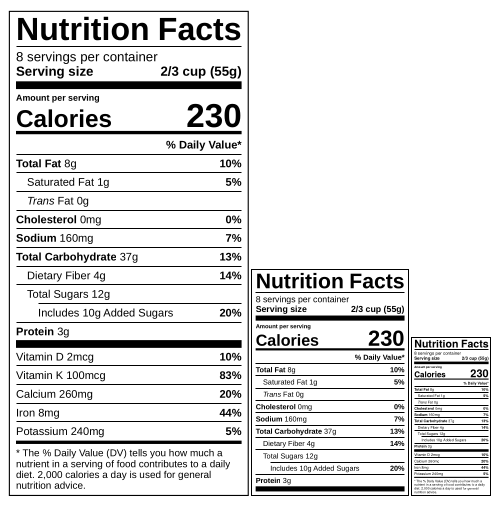

# Nutrition Label

A configurable Typst template to generate FDA-style nutrition fact labels. This package automates the layout and daily value percentage calculations, allowing you to create professional, accurate labels with minimal effort.



[View Example PDF](https://github.com/typst/packages/tree/main/packages/preview/nutrition-label-nam/0.2.0/example.pdf) · [View Example Typst File](https://github.com/typst/packages/tree/main/packages/preview/nutrition-label-nam/0.2.0/example.typ)

## Features

-   **Automatic DV Calculation:** Automatically calculates the % Daily Value based on the latest FDA reference data.
-   **Highly Configurable:** Adjust the font, scale the entire label, and toggle the footnote with optional parameters.
-   **Pixel-Perfect Layout:** Faithfully reproduces the official FDA nutrition label's fonts, weights, indentation, and line spacing.
-   **Flexible Micronutrients:** Dynamically generates the list of vitamins and minerals. Add, remove, or reorder them as needed.

## Usage

1.  **Import the Package**  
    Add the following line to your document's preamble:
    ```typst
    #import "@preview/nutrition-label-nam:0.2.0": nutrition-label-nam
    ```
    *(Note: Remember to update the version number as new releases become available.)*

2.  **Define Your Data**  
    Create a dictionary with your product's nutritional information. See the [Data Structure](#data-structure) section for details.
    ```typst
    #let sample-data = (
      servings: "8",
      serving_size: "2/3 cup (55g)",
      calories: "230",
      total_fat: (value: 8, unit: "g"),
      saturated_fat: (value: 1, unit: "g"),
      trans_fat: (value: 0, unit: "g"),
      cholesterol: (value: 0, unit: "mg"),
      sodium: (value: 160, unit: "mg"),
      carbohydrate: (value: 37, unit: "g"),
      fiber: (value: 4, unit: "g"),
      sugars: (value: 12, unit: "g"),
      added_sugars: (value: 10, unit: "g"),
      protein: (value: 3, unit: "g"),
      micronutrients: (
        (name: "Vitamin D", key: "vitamin_d", value: 2, unit: "mcg"),
        (name: "Calcium", key: "calcium", value: 260, unit: "mg"),
        (name: "Iron", key: "iron", value: 8.0, unit: "mg"),
        (name: "Potassium", key: "potassium", value: 240, unit: "mg"),
      ),
    )
    ```

3.  **Call the Function**  
    Call the `nutrition-label-nam` function with your data to render the label.
    ```typst
    #nutrition-label-nam(sample-data)
    ```

## Parameters

The `nutrition-label-nam` function accepts the following optional parameters to customize its appearance:

| Parameter       | Type            | Default             | Description                                                                                                                              |
| --------------- | --------------- | ------------------- | ---------------------------------------------------------------------------------------------------------------------------------------- |
| `font`          | `string`        | `"Liberation Sans"` | The font family to use. `"Tex Gyre Heros"` is a recommended free alternative that closely resembles the official "Helvetica" font.          |
| `scale-percent` | `relative length` | `100%`              | Scales the entire label proportionally. For example, `50%` will render the label at half its original size.                               |
| `show-footnote` | `boolean`       | `true`              | Toggles the visibility of the asterisk and the footnote explaining the % Daily Value.                                                      |

### Example with Options

```typst
#nutrition-label-nam(
  sample-data,
  font: "Tex Gyre Heros",
  scale-percent: 75%,
  show-footnote: false,
)
```

## Data Structure

The main `data` dictionary requires keys for `servings`, `serving_size`, `calories`, and then a dictionary for each nutrient.

-   **Main Nutrients:** (e.g., `total_fat`, `sodium`) require a dictionary with a `value` (number) and `unit` (string).
-   **Micronutrients:** The `micronutrients` key holds an array of dictionaries. This allows you to list any number of vitamins and minerals. Each must have a `name`, `key` (for DV calculation), `value`, and `unit`.

```typst
micronutrients: (
  (name: "Vitamin D", key: "vitamin_d", value: 2, unit: "mcg"),
  (name: "Calcium", key: "calcium", value: 260, unit: "mg"),
  // ... add as many as you need
)
```

## Daily Value Automation

The package automatically calculates the % Daily Value for nutrients based on the internal database below. To ensure correct calculation, provide the nutrient `value` in the unit specified by the FDA. The `key` in your `micronutrients` data must match a key from this table. In case you want to enter the DV% yourself or have micronutrients not found in this table, please use V0.1.0 that allows for this.

%DV for Protein and Trans Fat is intentionally not calculated, in accordance with standard FDA labeling practices.

> **Source:** [FDA Daily Value Reference Tables](https://www.fda.gov/food/nutrition-facts-label/daily-value-nutrition-and-supplement-facts-labels)

| Nutrient           | Key                | Daily Value |     | Nutrient       | Key            | Daily Value  |
| ------------------ | ------------------ | ----------- | --- | -------------- | -------------- | ------------ |
| Added Sugars       | `added_sugars`     | 50g         |     | Phosphorus     | `phosphorus`     | 1250mg       |
| Biotin             | `biotin`           | 30mcg       |     | Potassium      | `potassium`      | 4700mg       |
| Calcium            | `calcium`          | 1300mg      |     | Protein        | `protein`        | 50g          |
| Carbohydrate       | `carbohydrate`     | 275g        |     | Riboflavin     | `riboflavin`     | 1.3mg        |
| Chloride           | `chloride`         | 2300mg      |     | Saturated Fat  | `saturated_fat`  | 20g          |
| Choline            | `choline`          | 550mg       |     | Selenium       | `selenium`       | 55mcg        |
| Cholesterol        | `cholesterol`      | 300mg       |     | Sodium         | `sodium`         | 2300mg       |
| Chromium           | `chromium`         | 35mcg       |     | Thiamin        | `thiamin`        | 1.2mg        |
| Copper             | `copper`           | 0.9mg       |     | Total Fat      | `total_fat`      | 78g          |
| Dietary Fiber      | `fiber`            | 28g         |     | Vitamin A      | `vitamin_a`      | 900mcg RAE   |
| Folate             | `folate`           | 400mcg DFE  |     | Vitamin B6     | `vitamin_b6`     | 1.7mg        |
| Iodine             | `iodine`           | 150mcg      |     | Vitamin B12    | `vitamin_b12`    | 2.4mcg       |
| Iron               | `iron`             | 18mg        |     | Vitamin C      | `vitamin_c`      | 90mg         |
| Magnesium          | `magnesium`        | 420mg       |     | Vitamin D      | `vitamin_d`      | 20mcg        |
| Manganese          | `manganese`        | 2.3mg       |     | Vitamin E      | `vitamin_e`      | 15mg         |
| Molybdenum         | `molybdenum`       | 45mcg       |     | Vitamin K      | `vitamin_k`      | 120mcg       |
| Niacin             | `niacin`           | 16mg NE     |     | Zinc           | `zinc`           | 11mg         |
| Pantothenic Acid   | `pantothenic_acid` | 5mg         |     |                |                |              |

---

> ⚠️ **Disclaimer**  
> This package is provided as-is for design and templating purposes. The automatic calculation is a convenience feature. It is your responsibility to ensure all data provided is accurate and that the final rendered label complies with all applicable FDA regulations for your product. The authors of this package are not liable for any mislabeling.
---
